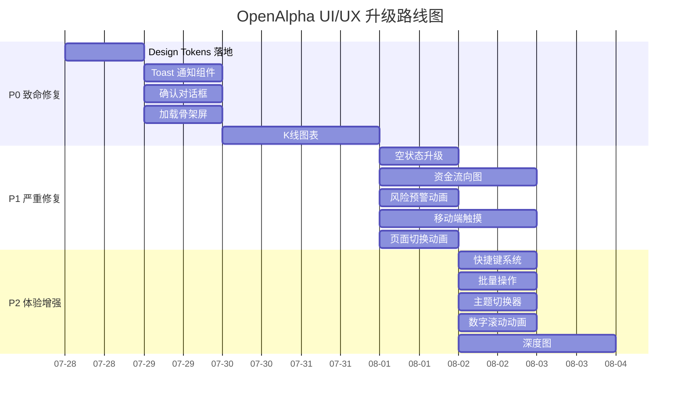

# OpenAlpha 套利平台 — 竞品差距分析与 UI/UX 全面升级方案

> **创建日期**: 2026-07-28
> **对标竞品**: Binance、OKX、1inch、Uniswap、ArbitrageScanner、Hummingbot、Bitsgap、3Commas
> **设计参考**: UI-UXpromax 高品质模板、AI-Trader 设计系统
> **技术栈**: React 18 + TypeScript + Tailwind CSS + Vite

---

## 第一部分：竞品差距分析报告

### 1.1 竞品功能矩阵对比

| 功能维度 | OpenAlpha 当前 | Binance | OKX | 1inch | Uniswap | Hummingbot | Bitsgap | 差距等级 |
|----------|---------------|---------|-----|-------|---------|------------|---------|---------|
| **功能完整性** | | | | | | | | |
| 跨所套利 | ✅ | ❌ | ❌ | ✅ | ❌ | ✅ | ✅ | 持平 |
| 网格交易 | ✅ | ✅ | ✅ | ❌ | ❌ | ✅ | ✅ | 持平 |
| DCA 定投 | ✅ | ✅ | ✅ | ❌ | ❌ | ❌ | ✅ | 持平 |
| 三角套利 | ✅ | ❌ | ❌ | ❌ | ❌ | ✅ | ❌ | **领先** |
| 回测引擎 | ✅基础 | ✅ | ✅ | ❌ | ❌ | ✅ | ✅ | 🟡落后 |
| AI 策略推荐 | ✅基础 | ❌ | ❌ | ❌ | ❌ | ❌ | ✅ | 持平 |
| 用户系统 | ✅基础 | ✅ | ✅ | ✅ | ✅ | ❌ | ✅ | 🟡落后 |
| **交互体验** | | | | | | | | |
| 页面路由 | ✅React Router | ✅ | ✅ | ✅ | ✅ | ❌CLI | ✅ | 持平 |
| 加载状态 | ❌ | ✅骨架屏 | ✅骨架屏 | ✅ | ✅ | ❌ | ✅ | 🔴缺失 |
| 错误提示 | ❌alert | ✅Toast | ✅Toast | ✅ | ✅ | ❌ | ✅ | 🔴缺失 |
| 确认对话框 | ❌confirm | ✅Modal | ✅Modal | ✅ | ✅ | ❌ | ✅ | 🔴缺失 |
| 空状态设计 | ✅基础 | ✅插画 | ✅插画 | ✅ | ✅ | ❌ | ✅ | 🟡落后 |
| **信息密度** | | | | | | | | |
| 价格矩阵 | ✅ | ✅深度图 | ✅深度图 | ✅ | ❌ | ❌ | ✅ | 🟡落后 |
| 订单簿深度 | ✅L2 10档 | ✅完整 | ✅完整 | ❌ | ❌ | ❌ | ❌ | 🟡落后 |
| K线图表 | ❌ | ✅TradingView | ✅TradingView | ❌ | ❌ | ❌ | ✅ | 🔴缺失 |
| 资金流向 | ❌ | ✅ | ✅ | ✅ | ✅ | ❌ | ❌ | 🔴缺失 |
| **交易效率** | | | | | | | | |
| 一键交易 | ✅ | ✅ | ✅ | ✅ | ✅ | ❌ | ✅ | 持平 |
| 批量操作 | ❌ | ✅ | ✅ | ✅ | ❌ | ❌ | ✅ | 🔴缺失 |
| 快捷键 | ❌ | ✅ | ✅ | ❌ | ❌ | ❌ | ❌ | 🟡落后 |
| **风控展示** | | | | | | | | |
| 风控进度条 | ✅ | ✅ | ✅ | ❌ | ❌ | ❌ | ✅ | 持平 |
| 实时盈亏 | ✅ | ✅ | ✅ | ❌ | ❌ | ❌ | ✅ | 持平 |
| 风险预警 | ❌ | ✅ | ✅ | ❌ | ❌ | ❌ | ✅ | 🔴缺失 |
| **移动端适配** | | | | | | | | |
| 响应式布局 | ✅基础 | ✅优秀 | ✅优秀 | ✅ | ✅ | ❌ | ✅ | 🟡落后 |
| 触摸交互 | ❌ | ✅ | ✅ | ✅ | ✅ | ❌ | ✅ | 🔴缺失 |
| 移动端手势 | ❌ | ✅ | ✅ | ✅ | ✅ | ❌ | ✅ | 🔴缺失 |

### 1.2 核心差距总结

#### 🔴 致命差距（6 项）

1. **无 K 线图表** — 竞品标配 TradingView，OpenAlpha 无任何 K 线可视化
2. **无加载状态** — 数据加载时无骨架屏/Spinner，用户体验割裂
3. **无 Toast 通知** — 用原生 `alert()` 提示，交互粗糙
4. **无确认对话框** — 用原生 `confirm()`，无法定制样式
5. **无资金流向图** — 缺少资金流向矩阵可视化
6. **无触摸交互** — 移动端无手势支持（滑动/下拉刷新/长按）

#### 🟡 严重差距（5 项）

7. **信息密度不足** — 价格矩阵无深度图，订单簿仅 10 档
8. **空状态设计简陋** — 仅文字提示，无插画/引导
9. **无快捷键** — 专业交易者依赖快捷键
10. **无批量操作** — 无法批量执行/取消机会
11. **无风险预警** — 风控触发时无视觉预警动画

#### ✅ 领先优势（2 项）

12. **三角套利** — Binance/OKX/Bitsgap 均无
13. **AI 策略推荐** — 仅 Bitsgap 有类似功能

---

## 第二部分：OpenAlpha 设计系统规范

### 2.1 设计理念

**"深空金融科技"** — 以深空蓝/暗碳灰为底色，高对比度数据强调色，营造专业、冷静、高效的量化交易氛围。

### 2.2 色彩系统

#### 主色调（深空蓝/暗碳灰底）

| Token 名称 | 暗色模式值 | 亮色模式值 | 用途 |
|------------|-----------|-----------|------|
| `--color-bg-base` | `#070B10` | `#F8FAFC` | 页面最底层背景 |
| `--color-bg-panel` | `#0C1319` | `#FFFFFF` | 侧边栏/顶栏背景 |
| `--color-bg-card` | `#0F171E` | `#F1F5F9` | 卡片/面板背景 |
| `--color-bg-elevated` | `#121B22` | `#E2E8F0` | 悬浮元素背景 |
| `--color-bg-hover` | `#152029` | `#CBD5E1` | 悬停态背景 |

#### 辅助色（高对比度数据强调色）

| Token 名称 | 暗色模式值 | 亮色模式值 | 用途 |
|------------|-----------|-----------|------|
| `--color-up` | `#0ECB81` | `#0EA871` | 涨/盈利/买入 |
| `--color-down` | `#F6465D` | `#DC2640` | 跌/亏损/卖出 |
| `--color-warning` | `#FBBF24` | `#D97706` | 警告/中风险 |
| `--color-info` | `#2196F3` | `#1976D2` | 信息/链接 |
| `--color-accent` | `#D4A458` | `#B8823D` | 品牌强调色（金色） |
| `--color-accent-gradient` | `linear-gradient(135deg, #C99549 0%, #E0BA74 100%)` | 同左 | 品牌渐变 |

#### 文字色

| Token 名称 | 暗色模式值 | 亮色模式值 | 用途 |
|------------|-----------|-----------|------|
| `--color-text-primary` | `#F2EFE6` | `#0F172A` | 主要文字 |
| `--color-text-secondary` | `#A3AFB8` | `#475569` | 次要文字 |
| `--color-text-muted` | `#73808B` | `#94A3B8` | 弱化文字 |
| `--color-text-disabled` | `#3D4751` | `#CBD5E1` | 禁用文字 |

#### 边框色

| Token 名称 | 暗色模式值 | 亮色模式值 | 用途 |
|------------|-----------|-----------|------|
| `--color-border` | `rgba(122,140,155,0.16)` | `#E2E8F0` | 默认边框 |
| `--color-border-light` | `rgba(214,175,110,0.24)` | `#CBD5E1` | 强调边框 |
| `--color-border-hover` | `rgba(214,175,110,0.4)` | `#94A3B8` | 悬停边框 |

### 2.3 字体层级与排版规范

#### 字体族

```css
--font-ui: 'IBM Plex Sans', -apple-system, BlinkMacSystemFont, 'Segoe UI', sans-serif;
--font-mono: 'IBM Plex Mono', 'JetBrains Mono', 'SF Mono', Consolas, monospace;
--font-display: 'IBM Plex Sans', sans-serif;  /* 标题专用 */
```

#### 字号层级

| Token | 字号 | 行高 | 字重 | 用途 |
|-------|------|------|------|------|
| `--text-xs` | 11px | 16px | 400 | 辅助标签 |
| `--text-sm` | 13px | 20px | 400 | 正文/表格 |
| `--text-base` | 14px | 22px | 400 | 默认正文 |
| `--text-lg` | 16px | 24px | 600 | 面板标题 |
| `--text-xl` | 20px | 28px | 700 | 页面标题 |
| `--text-2xl` | 26px | 34px | 700 | KPI 数值 |
| `--text-3xl` | 32px | 40px | 800 | 大标题 |

#### 数字排版

- 所有数字使用 `font-mono` + `font-variant-numeric: tabular-nums`
- 价格按量级自适应小数位：≥1000→2位，≥1→4位，<1→6位
- 百分比统一 3 位小数 + `%` 后缀
- USDT 金额 2 位小数 + `$` 前缀，负数用 `-` 前缀

### 2.4 圆角/阴影/边框规范

#### 圆角

| Token | 值 | 用途 |
|-------|-----|------|
| `--radius-sm` | 8px | 按钮/输入框/小标签 |
| `--radius-md` | 12px | 卡片/面板 |
| `--radius-lg` | 16px | 大面板/模态框 |
| `--radius-full` | 9999px | 圆形/胶囊 |

#### 阴影

| Token | 暗色模式值 | 用途 |
|-------|-----------|------|
| `--shadow-sm` | `0 10px 24px rgba(0,0,0,0.18)` | 卡片悬浮 |
| `--shadow-md` | `0 18px 40px rgba(0,0,0,0.28)` | 弹出层 |
| `--shadow-lg` | `0 28px 70px rgba(0,0,0,0.38)` | 模态框 |
| `--shadow-glow-up` | `0 0 20px rgba(14,203,129,0.3)` | 盈利发光 |
| `--shadow-glow-down` | `0 0 20px rgba(246,70,93,0.3)` | 亏损发光 |

#### 边框

| Token | 值 | 用途 |
|-------|-----|------|
| `--border-default` | `1px solid var(--color-border)` | 默认 |
| `--border-accent` | `1px solid var(--color-border-light)` | 强调 |
| `--border-dashed` | `1px dashed var(--color-border)` | 占位/拖拽区 |

### 2.5 数据可视化图表样式

#### K 线图（TradingView Lightweight Charts）

- 背景透明，网格线 `rgba(122,140,155,0.08)`
- 涨蜡烛：空心 + `#0ECB81` 边框
- 跌蜡烛：实心 + `#F6465D` 填充
- 成交量：底部柱状图，涨绿跌红半透明
- 十字线：`rgba(214,175,110,0.5)` 虚线

#### 套利机会热力图

- 单元格最小 70px × 32px
- 颜色梯度：0%→`#0ECB81`，0.5%→`#FBBF24`，1%+→`#F6465D`
- 悬浮：`scale(1.05)` + `z-index:10` + tooltip
- 点击：触发执行确认对话框

#### 资金流向矩阵

- 节点：交易所 Logo + 余额数值
- 连线：粗细=流量，颜色=方向（绿=流入，红=流出）
- 动画：流动粒子效果（CSS animation）

#### 收益曲线

- 主线：`#D4A458` 渐变（金色品牌色）
- 填充：`rgba(212,164,88,0.1)` 渐变透明
- 基准线：`rgba(122,140,155,0.3)` 虚线
- 回撤区域：`rgba(246,70,93,0.15)` 填充

### 2.6 动效与过渡规范

#### 微交互动效

| 场景 | 动效 | 时长 | 缓动 |
|------|------|------|------|
| 数据刷新 | 背景闪烁 `flash` | 0.4s | ease-out |
| 数字变化 | 滚动计数 `count-up` | 0.3s | ease |
| 按钮悬停 | `opacity:0.85` + `translateY(-1px)` | 0.2s | ease |
| 卡片悬浮 | `shadow-sm` → `shadow-md` | 0.3s | ease |
| 机会出现 | `slideInRight` + `flash` | 0.4s | ease-out |
| 风控预警 | `pulse-red` 边框闪烁 | 1s infinite | ease |
| 加载骨架 | `shimmer` 光波扫描 | 1.5s infinite | linear |

#### 页面切换动画

- 进入：`fadeIn + slideUp`（opacity 0→1, translateY 10px→0），0.3s
- 离开：`fadeOut`（opacity 1→0），0.2s
- Tab 切换：`slideInLeft/Right`，0.25s

#### 关键帧定义

```css
@keyframes flash { 0% { background: rgba(14,203,129,0.2); } 100% { background: transparent; } }
@keyframes shimmer { 0% { background-position: -200% 0; } 100% { background-position: 200% 0; } }
@keyframes slideInRight { 0% { opacity:0; transform: translateX(20px); } 100% { opacity:1; transform: translateX(0); } }
@keyframes pulseRed { 0%,100% { border-color: rgba(246,70,93,0.3); } 50% { border-color: rgba(246,70,93,1); } }
@keyframes countUp { 0% { opacity:0; transform: translateY(5px); } 100% { opacity:1; transform: translateY(0); } }
```

### 2.7 布局与画布尺寸规范

#### 响应式断点

| 断点 | 宽度 | 布局 | 信息密度 |
|------|------|------|---------|
| `xs` | <640px | 单栏 + 底部 Tab | 低（仅核心数据） |
| `sm` | 640-768px | 单栏 + 抽屉侧边栏 | 低 |
| `md` | 768-1024px | 双栏（侧边栏+主区） | 中 |
| `lg` | 1024-1280px | 三栏（侧边栏+主区+右栏） | 高 |
| `xl` | 1280-1536px | 三栏 + 宽松间距 | 高 |
| `2xl` | >1536px | 三栏 + 最大宽度 1600px | 极高 |

#### 仪表盘栅格系统

- 基础栅格：12 列，间距 12px（`gap-3`）
- KPI 行：4 列（`grid-cols-4`），移动端 2 列
- 主内容区：8 列 + 右栏 4 列
- 卡片最小高度：80px（KPI）/ 200px（图表）/ 300px（表格）

#### 信息密度分级

| 级别 | 场景 | 字号 | 间距 | 表格行高 |
|------|------|------|------|---------|
| 紧凑 | 监控仪表盘 | xs(11px) | 8px | 32px |
| 标准 | 管理页面 | sm(13px) | 12px | 40px |
| 宽松 | 报告页面 | base(14px) | 16px | 48px |

### 2.8 暗色/亮色双主题切换

#### 切换机制

- `html` 标签添加 `class="dark"` 或 `class="light"`
- CSS 变量在 `:root`（暗色默认）和 `:root[data-theme='light']` 中分别定义
- 用户偏好存储在 `localStorage`，默认跟随系统 `prefers-color-scheme`
- 切换时无闪烁（先设置 class 再渲染）

#### 完整色彩映射

见第三部分 Design Tokens 代码。

---

## 第三部分：Design Tokens（React + TypeScript + Tailwind CSS）

### 3.1 Tailwind 配置（tailwind.config.ts）

```typescript
import type { Config } from 'tailwindcss';

export default {
  content: ['./index.html', './src/**/*.{js,ts,jsx,tsx}'],
  darkMode: 'class',
  theme: {
    extend: {
      colors: {
        // 背景色
        base: {
          DEFAULT: 'var(--color-bg-base)',
          panel: 'var(--color-bg-panel)',
          card: 'var(--color-bg-card)',
          elevated: 'var(--color-bg-elevated)',
          hover: 'var(--color-bg-hover)',
        },
        // 数据强调色
        up: 'var(--color-up)',
        down: 'var(--color-down)',
        warning: 'var(--color-warning)',
        info: 'var(--color-info)',
        accent: {
          DEFAULT: 'var(--color-accent)',
          gradient: 'var(--color-accent-gradient)',
        },
        // 文字色
        text: {
          primary: 'var(--color-text-primary)',
          secondary: 'var(--color-text-secondary)',
          muted: 'var(--color-text-muted)',
          disabled: 'var(--color-text-disabled)',
        },
        // 边框色
        border: {
          DEFAULT: 'var(--color-border)',
          light: 'var(--color-border-light)',
          hover: 'var(--color-border-hover)',
        },
      },
      fontFamily: {
        ui: ['IBM Plex Sans', 'sans-serif'],
        mono: ['IBM Plex Mono', 'monospace'],
        display: ['IBM Plex Sans', 'sans-serif'],
      },
      fontSize: {
        xs: ['11px', '16px'],
        sm: ['13px', '20px'],
        base: ['14px', '22px'],
        lg: ['16px', '24px'],
        xl: ['20px', '28px'],
        '2xl': ['26px', '34px'],
        '3xl': ['32px', '40px'],
      },
      borderRadius: {
        sm: '8px',
        md: '12px',
        lg: '16px',
        xl: '20px',
      },
      boxShadow: {
        sm: 'var(--shadow-sm)',
        md: 'var(--shadow-md)',
        lg: 'var(--shadow-lg)',
        'glow-up': 'var(--shadow-glow-up)',
        'glow-down': 'var(--shadow-glow-down)',
      },
      animation: {
        'flash': 'flash 0.4s ease-out',
        'shimmer': 'shimmer 1.5s infinite linear',
        'slide-in-right': 'slideInRight 0.4s ease-out',
        'pulse-red': 'pulseRed 1s infinite ease',
        'count-up': 'countUp 0.3s ease',
        'fade-in': 'fadeIn 0.3s ease',
        'slide-up': 'slideUp 0.3s ease',
      },
      keyframes: {
        flash: {
          '0%': { backgroundColor: 'rgba(14,203,129,0.2)' },
          '100%': { backgroundColor: 'transparent' },
        },
        shimmer: {
          '0%': { backgroundPosition: '-200% 0' },
          '100%': { backgroundPosition: '200% 0' },
        },
        slideInRight: {
          '0%': { opacity: '0', transform: 'translateX(20px)' },
          '100%': { opacity: '1', transform: 'translateX(0)' },
        },
        pulseRed: {
          '0%, 100%': { borderColor: 'rgba(246,70,93,0.3)' },
          '50%': { borderColor: 'rgba(246,70,93,1)' },
        },
        countUp: {
          '0%': { opacity: '0', transform: 'translateY(5px)' },
          '100%': { opacity: '1', transform: 'translateY(0)' },
        },
        fadeIn: {
          '0%': { opacity: '0' },
          '100%': { opacity: '1' },
        },
        slideUp: {
          '0%': { opacity: '0', transform: 'translateY(10px)' },
          '100%': { opacity: '1', transform: 'translateY(0)' },
        },
      },
    },
  },
  plugins: [],
} satisfies Config;
```

### 3.2 CSS 变量定义（index.css）

```css
@import url('https://fonts.googleapis.com/css2?family=IBM+Plex+Sans:wght@400;500;600;700;800&family=IBM+Plex+Mono:wght@400;500;600&display=swap');

/* 暗色主题（默认） */
:root {
  --color-bg-base: #070B10;
  --color-bg-panel: #0C1319;
  --color-bg-card: #0F171E;
  --color-bg-elevated: #121B22;
  --color-bg-hover: #152029;

  --color-up: #0ECB81;
  --color-down: #F6465D;
  --color-warning: #FBBF24;
  --color-info: #2196F3;
  --color-accent: #D4A458;
  --color-accent-gradient: linear-gradient(135deg, #C99549 0%, #E0BA74 100%);

  --color-text-primary: #F2EFE6;
  --color-text-secondary: #A3AFB8;
  --color-text-muted: #73808B;
  --color-text-disabled: #3D4751;

  --color-border: rgba(122, 140, 155, 0.16);
  --color-border-light: rgba(214, 175, 110, 0.24);
  --color-border-hover: rgba(214, 175, 110, 0.4);

  --shadow-sm: 0 10px 24px rgba(0, 0, 0, 0.18);
  --shadow-md: 0 18px 40px rgba(0, 0, 0, 0.28);
  --shadow-lg: 0 28px 70px rgba(0, 0, 0, 0.38);
  --shadow-glow-up: 0 0 20px rgba(14, 203, 129, 0.3);
  --shadow-glow-down: 0 0 20px rgba(246, 70, 93, 0.3);
}

/* 亮色主题 */
:root[data-theme='light'] {
  --color-bg-base: #F8FAFC;
  --color-bg-panel: #FFFFFF;
  --color-bg-card: #F1F5F9;
  --color-bg-elevated: #E2E8F0;
  --color-bg-hover: #CBD5E1;

  --color-up: #0EA871;
  --color-down: #DC2640;
  --color-warning: #D97706;
  --color-info: #1976D2;
  --color-accent: #B8823D;
  --color-accent-gradient: linear-gradient(135deg, #B8823D 0%, #D4A458 100%);

  --color-text-primary: #0F172A;
  --color-text-secondary: #475569;
  --color-text-muted: #94A3B8;
  --color-text-disabled: #CBD5E1;

  --color-border: #E2E8F0;
  --color-border-light: #CBD5E1;
  --color-border-hover: #94A3B8;

  --shadow-sm: 0 4px 12px rgba(0, 0, 0, 0.08);
  --shadow-md: 0 8px 24px rgba(0, 0, 0, 0.12);
  --shadow-lg: 0 16px 48px rgba(0, 0, 0, 0.16);
  --shadow-glow-up: 0 0 16px rgba(14, 168, 113, 0.2);
  --shadow-glow-down: 0 0 16px rgba(220, 38, 64, 0.2);
}
```

### 3.3 TypeScript Design Tokens 类型定义

```typescript
// src/types/design-tokens.ts
export interface DesignTokens {
  colors: {
    bg: { base: string; panel: string; card: string; elevated: string; hover: string };
    data: { up: string; down: string; warning: string; info: string; accent: string };
    text: { primary: string; secondary: string; muted: string; disabled: string };
    border: { default: string; light: string; hover: string };
  };
  typography: {
    fontFamily: { ui: string; mono: string; display: string };
    fontSize: Record<'xs'|'sm'|'base'|'lg'|'xl'|'2xl'|'3xl', { size: string; lineHeight: string }>;
  };
  shape: {
    borderRadius: { sm: string; md: string; lg: string; xl: string; full: string };
    boxShadow: Record<'sm'|'md'|'lg'|'glowUp'|'glowDown', string>;
    border: { default: string; accent: string; dashed: string };
  };
  motion: {
    duration: { fast: string; normal: string; slow: string };
    easing: { ease: string; easeOut: string; easeIn: string };
    animation: Record<string, string>;
  };
  layout: {
    breakpoints: Record<'xs'|'sm'|'md'|'lg'|'xl'|'2xl', string>;
    spacing: { xs: string; sm: string; md: string; lg: string; xl: string };
    gridCols: number;
  };
}
```

---

## 第四部分：优化任务清单（实施步骤 + 优先级 + 预期效果）

### P0 — 致命差距修复（立即执行）

#### 任务 1：Design Tokens 系统落地
- **步骤**: 替换 `tailwind.config.js` → `tailwind.config.ts` + 更新 `index.css` CSS 变量 + 创建 `src/types/design-tokens.ts`
- **优先级**: P0
- **预期效果**: 统一设计语言，支持暗/亮双主题切换

#### 任务 2：Toast 通知组件
- **步骤**: 创建 `src/components/common/Toast.tsx`（Zustand store + 自动消失 + 多类型）+ 替换所有 `alert()` 调用
- **优先级**: P0
- **预期效果**: 替代原生 alert，支持 success/error/warning/info 四种类型

#### 任务 3：确认对话框组件
- **步骤**: 创建 `src/components/common/ConfirmDialog.tsx`（Modal + 自定义文案/按钮）+ 替换所有 `confirm()` 调用
- **优先级**: P0
- **预期效果**: 替代原生 confirm，可定制样式和按钮文案

#### 任务 4：加载骨架屏组件
- **步骤**: 创建 `src/components/common/Skeleton.tsx`（shimmer 动画）+ 在数据加载时显示
- **优先级**: P0
- **预期效果**: 消除白屏等待，提升感知速度

#### 任务 5：K 线图表组件
- **步骤**: 安装 `lightweight-charts` + 创建 `src/components/charts/KlineChart.tsx` + 集成到 Dashboard
- **优先级**: P0
- **预期效果**: 专业 K 线可视化，对标 Binance/OKX

### P1 — 严重差距修复

#### 任务 6：空状态组件升级
- **步骤**: 创建 `src/components/common/EmptyState.tsx`（SVG 插画 + 引导文案 + 操作按钮）
- **优先级**: P1
- **预期效果**: 提升空数据时的用户体验

#### 任务 7：资金流向矩阵图
- **步骤**: 创建 `src/components/charts/FlowMatrix.tsx`（D3 或 SVG 节点连线图）
- **优先级**: P1
- **预期效果**: 可视化跨所资金流动

#### 任务 8：风险预警动画
- **步骤**: 风控触发时添加 `pulse-red` 边框动画 + 顶部横幅告警
- **优先级**: P1
- **预期效果**: 风控状态视觉醒目

#### 任务 9：移动端触摸交互
- **步骤**: 添加 `react-swipeable` + 侧边栏滑动手势 + 下拉刷新 + 长按菜单
- **优先级**: P1
- **预期效果**: 移动端体验对标 Binance App

#### 任务 10：页面切换动画
- **步骤**: 使用 `framer-motion` 或 CSS transition 实现路由切换 fadeIn/slideUp
- **优先级**: P1
- **预期效果**: 流畅的页面过渡

### P2 — 体验增强

#### 任务 11：快捷键系统
- **步骤**: 创建 `src/hooks/useHotkeys.ts`（s=搜索/e=执行/r=刷新/d=切换主题）
- **优先级**: P2
- **预期效果**: 专业交易者效率提升

#### 任务 12：批量操作
- **步骤**: 机会列表添加多选 checkbox + 批量执行/忽略按钮
- **优先级**: P2
- **预期效果**: 批量处理套利机会

#### 任务 13：主题切换器
- **步骤**: 创建 `src/components/common/ThemeToggle.tsx` + `src/hooks/useTheme.ts`
- **优先级**: P2
- **预期效果**: 暗/亮主题一键切换

#### 任务 14：数字滚动动画
- **步骤**: 创建 `src/components/common/AnimatedNumber.tsx`（count-up 动画）
- **优先级**: P2
- **预期效果**: KPI 数字变化时有滚动动效

#### 任务 15：深度图组件
- **步骤**: 创建 `src/components/charts/DepthChart.tsx`（买卖盘深度可视化）
- **优先级**: P2
- **预期效果**: 订单簿深度图形化展示

---

## 第五部分：实施路线图



---

## 预期最终效果

升级完成后，OpenAlpha 将具备：
- ✅ 专业级 K 线图表（对标 Binance/OKX）
- ✅ 完整的交互反馈系统（Toast/Modal/骨架屏/空状态）
- ✅ 深空金融科技视觉语言（金色品牌色 + 深蓝底）
- ✅ 暗/亮双主题切换
- ✅ 流畅的微交互动效与页面过渡
- ✅ 移动端触摸交互（手势/下拉刷新）
- ✅ 高信息密度仪表盘（K线+深度图+热力图+资金流向）
- ✅ 差异化优势保留（三角套利 + AI 推荐）
