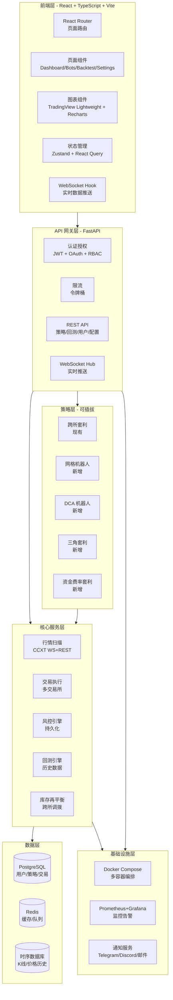
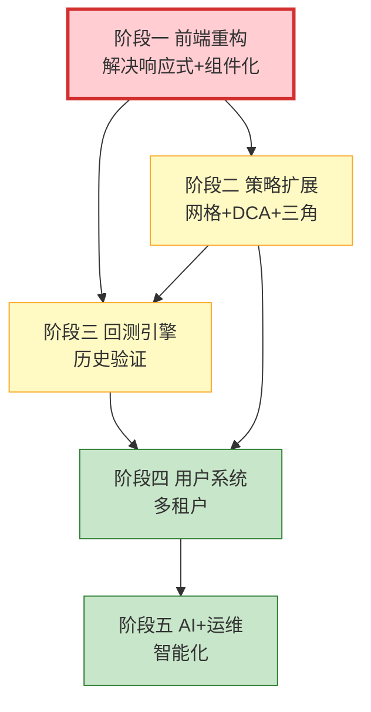

# OpenAlpha 套利系统 — 与主流软件差距分析及全栈追赶计划

> **创建日期**: 2026-07-28
> **对标产品**: Bitsgap（80 万用户 / 3000 亿美元交易量）、3Commas、Pionex
> **本地参考**: AI-Trader（React+TS+Vite 全栈）、QuantDinger（Python 后端+MCP）
> **当前状态**: 单页 HTML 前端 + 单一套利策略 + 模拟交易运行中

---

## 一、差距分析总览

### 1.1 差距雷达图（0-10 分制）

| 维度 | OpenAlpha 当前 | Bitsgap 对标 | 差距 | 严重度 |
|------|---------------|-------------|------|--------|
| **前端架构** | 2/10（单页 HTML 3000 行） | 10/10（React+TS+Vite SPA） | 8 | 🔴 致命 |
| **响应式适配** | 2/10（竖屏横屏割裂） | 10/10（移动端优先自适应） | 8 | 🔴 致命 |
| **策略多样性** | 2/10（仅跨所价差套利） | 9/10（6 种机器人策略） | 7 | 🔴 致命 |
| **图表可视化** | 3/10（Chart.js 单图） | 9/10（TradingView 集成） | 6 | 🟡 严重 |
| **回测能力** | 1/10（无回测引擎） | 9/10（365 天回测） | 8 | 🔴 致命 |
| **用户系统** | 1/10（仅 Token 鉴权） | 9/10（注册/登录/OAuth/多用户） | 8 | 🔴 致命 |
| **交易所覆盖** | 6/10（6 所现货） | 9/10（15+ 所现货+合约） | 3 | 🟡 严重 |
| **风控体系** | 5/10（4 条规则内存态） | 8/10（追踪止损/止盈/分批） | 3 | 🟡 严重 |
| **数据持久化** | 5/10（SQLite 单表） | 9/10（PostgreSQL+时序库） | 4 | 🟡 严重 |
| **告警通知** | 4/10（Telegram 单通道） | 8/10（多通道+AI 推荐） | 4 | 🟡 严重 |
| **AI 能力** | 0/10（无） | 8/10（AI 助手+策略推荐） | 8 | 🔴 致命 |
| **部署运维** | 4/10（Docker 单机） | 9/10（云原生+监控） | 5 | 🟡 严重 |
| **文档测试** | 3/10（文档有/测试无） | 8/10（完整文档+CI/CD） | 5 | 🟡 严重 |

**综合评分**: OpenAlpha **38/130**（29%）vs Bitsgap **105/130**（81%）

### 1.2 核心差距详解

#### 差距 1：前端架构落后（🔴 致命）

**现状**: [`frontend/index.html`](openalpha-arbitrage/frontend/index.html) 是 3000 行单文件 HTML，内联 CSS+JS，无组件化、无路由、无状态管理。

**问题**:
- 竖屏/横屏布局割裂：CSS 媒体查询仅做了简单断点，Tab 面板在移动端无法正常使用
- 无路由：4 个 Tab 用 `display:none` 切换，无法分享链接、无法浏览器前进后退
- 无状态管理：全局变量散落，数据流混乱
- 无组件复用：表格/卡片/图表代码重复
- 无 TypeScript：类型安全为零，重构困难

**对标**: AI-Trader 使用 React 18 + TypeScript + Vite + React Router + Recharts，有完整的页面路由、主题切换、i18n、通知系统。

#### 差距 2：策略单一（🔴 致命）

**现状**: 仅跨交易所现货价差套利（[`arbitrage.py`](openalpha-arbitrage/backend/arbitrage.py)），且主流币价差 <0.02% 扣费后无利可图。

**对标 Bitsgap 6 种策略**:
| 策略 | Bitsgap | OpenAlpha | 适用场景 |
|------|---------|-----------|---------|
| 网格交易（GRID） | ✅ | ❌ | 震荡行情 |
| 定投策略（DCA） | ✅ | ❌ | 下跌分批买入 |
| 逢低买入（BTD） | ✅ | ❌ | 抄底 |
| 循环机器人（LOOP） | ✅ | ❌ | 复利循环 |
| 合约网格（COMBO） | ✅ | ❌ | 合约杠杆 |
| 跨所套利 | ✅ | ✅ | 价差套利 |

#### 差距 3：无回测引擎（🔴 致命）

**现状**: 无任何回测能力，策略调参全靠实盘试错。

**对标**: Bitsgap 支持 30-365 天历史回测，AI-Trader 有完整的回测框架。OpenAlpha 的 [`OpenAlpha/backtest/`](OpenAlpha/backtest/) 目录有 80+ 回测模块但未集成到套利系统。

#### 差距 4：无用户系统（🔴 致命）

**现状**: 仅 Token 鉴权（[`auth.py`](openalpha-arbitrage/backend/auth.py)），单用户模式。

**对标**: Bitsgap 有注册/登录/OAuth/订阅套餐/多用户隔离。AI-Trader 有完整的 JWT 认证+权限系统。

#### 差距 5：无 AI 能力（🔴 致命）

**现状**: 无任何 AI 功能。

**对标**: Bitsgap 2024 年推出 AI 助手，能根据资金量/风险偏好自动推荐策略组合。OpenAlpha 的 [`OpenAlpha_Evolve/`](OpenAlpha_Evolve/) 有 AI 进化框架但未集成。

---

## 二、全栈追赶架构设计

### 2.1 目标架构

### 2.2 技术栈选型

| 层 | 当前 | 目标 | 理由 |
|----|------|------|------|
| 前端框架 | 原生 HTML | **React 18 + TypeScript** | 组件化、类型安全、生态成熟 |
| 构建工具 | 无 | **Vite 5** | 极速 HMR、ESM 原生 |
| 路由 | 无 | **React Router 6** | SPA 路由标准 |
| 状态管理 | 全局变量 | **Zustand + React Query** | 轻量+服务端状态分离 |
| UI 组件库 | 手写 CSS | **Tailwind CSS + shadcn/ui** | 原子化+可定制组件 |
| 图表 | Chart.js | **TradingView Lightweight Charts + Recharts** | 专业 K 线+统计图 |
| 后端框架 | FastAPI | **FastAPI（保留）** | 已有基础，性能优秀 |
| 数据库 | SQLite | **PostgreSQL + Redis** | 多用户并发+缓存 |
| 时序数据 | 无 | **TimescaleDB** | PostgreSQL 扩展，K 线存储 |
| 认证 | Token | **JWT + OAuth 2.0** | 标准+社交登录 |
| 监控 | 无 | **Prometheus + Grafana** | 行业标准 |
| 部署 | Docker 单容器 | **Docker Compose 多容器** | 微服务编排 |

---

## 三、追赶流程（分 5 个阶段）

### 阶段一：前端重构（最高优先级）

**目标**: 将单页 HTML 重构为 React SPA，解决响应式问题

#### 任务清单

- [ ] **1.1 初始化 React 项目**
  - Vite + React 18 + TypeScript 脚手架
  - 配置 Tailwind CSS + shadcn/ui
  - 配置 React Router 6 路由结构
  - 配置 Zustand 状态管理 + React Query 数据获取

- [ ] **1.2 布局系统重构**
  - 响应式 Sidebar（桌面侧边栏 / 移动端抽屉）
  - 顶部导航栏（Logo + 状态指示 + 用户菜单）
  - 主内容区自适应网格布局
  - 暗色/亮色主题切换（CSS 变量 + Tailwind dark mode）

- [ ] **1.3 页面组件开发**
  - `Dashboard` — 实时监控（KPI 卡片 + 价格矩阵 + 机会流 + 风控条）
  - `Bots` — 策略机器人管理（列表 + 创建 + 配置 + 监控）
  - `Backtest` — 回测面板（参数配置 + 结果可视化）
  - `Heatmap` — 价差热力图（矩阵 + 悬浮详情）
  - `Reports` — 每日报告（日期选择 + KPI + 图表 + 表格）
  - `Settings` — 设置（交易所 API Key + 风控参数 + 通知配置）
  - `Login/Register` — 用户认证页面

- [ ] **1.4 核心组件库**
  - `PriceMatrix` — 价格对比矩阵（高亮最优价 + 闪烁动画）
  - `OpportunityCard` — 套利机会卡片（路由 + 风险灯 + 执行按钮）
  - `TradeTable` — 交易历史表格（分页 + 筛选 + 导出 CSV）
  - `RiskPanel` — 风控可视化（进度条 + 暂停/恢复）
  - `SpreadChart` — 价差趋势图（TradingView Lightweight）
  - `KlineChart` — K 线图（TradingView Lightweight）
  - `ExchangeStatus` — 交易所状态列表（连接 + 延迟 + 模式）
  - `LogStream` — 实时日志流（搜索 + 过滤 + 暂停）

- [ ] **1.5 WebSocket 实时数据层**
  - `useWebSocket` Hook（自动重连 + 心跳 + 消息分发）
  - `usePrices` / `useOpportunities` / `useTrades` 数据 Hook
  - REST 兜底轮询（WS 断线时自动切换）

- [ ] **1.6 移动端适配**
  - 移动端优先的响应式断点（sm/md/lg/xl）
  - 触摸友好的交互（手势滑动 Tab、下拉刷新）
  - 移动端专用布局（底部 Tab 栏 + 全屏图表）

### 阶段二：策略扩展

**目标**: 从单一跨所套利扩展到 5 种策略

#### 任务清单

- [ ] **2.1 策略框架抽象**
  - 定义 `BaseStrategy` 抽象基类（启动/停止/状态/配置）
  - 策略注册中心（动态加载/卸载）
  - 策略调度器（并发运行多个策略实例）

- [ ] **2.2 网格交易机器人（GRID Bot）**
  - 价格区间设定 + 网格密度计算
  - 自动挂单/撤单/补单逻辑
  - 网格利润统计 + 止损机制
  - 单交易所内运行（无需跨所）

- [ ] **2.3 DCA 定投机器人**
  - 定期定额买入 + 价格下跌加码
  - 目标利润自动卖出
  - 平均成本计算 + 持仓管理

- [ ] **2.4 三角套利策略**
  - 同所内 A→B→C→A 路径检测
  - L2 订单簿深度计算
  - 三笔单原子执行（任一失败回滚）

- [ ] **2.5 资金费率套利**
  - 现货多头 + 永续空头对冲
  - 资金费率收取（8 小时周期）
  - 基差监控 + 自动平仓

- [ ] **2.6 库存再平衡**
  - 跨所余额监控 + 偏差检测
  - 自动调拨（链上转账 / 反向套利）
  - 再平衡成本计入利润

### 阶段三：回测引擎

**目标**: 支持历史数据回测，验证策略效果

#### 任务清单

- [ ] **3.1 历史数据采集**
  - K 线数据下载（CCXT fetch_ohlcv）
  - 存储到 TimescaleDB（时序分区 + 压缩）
  - 数据补全 + 清洗 + 对齐

- [ ] **3.2 回测引擎核心**
  - 事件驱动回测框架（参考 OpenAlpha/backtest/engine.py）
  - 滑点模型 + 手续费模拟
  - 资金管理 + 仓位追踪
  - 性能指标计算（夏普比率/最大回撤/胜率）

- [ ] **3.3 回测可视化**
  - 收益曲线图
  - 交易分布图（盈亏直方图）
  - 参数扫描热力图
  - 回测报告导出（PDF/CSV）

- [ ] **3.4 策略参数优化**
  - 网格搜索 / 贝叶斯优化
  - Walk-forward 分析
  - 过拟合检测

### 阶段四：用户系统与多租户

**目标**: 支持多用户注册/登录/订阅

#### 任务清单

- [ ] **4.1 用户认证**
  - JWT Token 认证（access + refresh）
  - OAuth 2.0 社交登录（GitHub / Google）
  - 邮箱注册 + 验证码
  - 密码加密（bcrypt）

- [ ] **4.2 多租户隔离**
  - 用户-策略-交易关联模型
  - API Key 按用户隔离存储（加密）
  - 数据权限控制（RBAC）

- [ ] **4.3 订阅套餐**
  - Free / Basic / Pro 套餐定义
  - 策略数量限制 + 回测天数限制
  - 支付集成（USDT / 支付宝）

### 阶段五：AI 能力与运维

**目标**: AI 策略推荐 + 生产级运维

#### 任务清单

- [ ] **5.1 AI 策略推荐**
  - 市场状态识别（趋势/震荡/波动率）
  - 基于用户风险偏好的策略推荐
  - 策略组合优化（马科维茨模型）

- [ ] **5.2 监控告警**
  - Prometheus 指标采集
  - Grafana 仪表盘
  - 多通道告警（Telegram / Discord / 邮件 / 短信）

- [ ] **5.3 CI/CD**
  - GitHub Actions 自动测试 + 构建
  - 自动部署到服务器
  - 蓝绿部署 / 滚动更新

---

## 四、优先级排序与依赖关系

**建议执行顺序**:
1. **阶段一（前端重构）** — 立即开始，解决用户最痛的 UI 问题
2. **阶段二（策略扩展）** — 前端完成后并行开发，网格机器人优先
3. **阶段三（回测引擎）** — 依赖策略框架，复用 OpenAlpha/backtest/
4. **阶段四（用户系统）** — 商业化前提，依赖前端+后端稳定
5. **阶段五（AI+运维）** — 长期演进，锦上添花

---

## 五、验收标准

| 阶段 | 验收标准 | 验证方法 |
|------|---------|---------|
| 阶段一 | 移动端+桌面端布局一致；4 个页面路由可访问 | Lighthouse 移动端评分 >80 |
| 阶段二 | 至少 3 种策略可运行（套利+网格+DCA） | 模拟模式 7 天盈利 |
| 阶段三 | 支持 30 天回测 + 收益曲线 | 回测报告生成 |
| 阶段四 | 用户可注册登录 + 数据隔离 | 多用户并发测试 |
| 阶段五 | AI 推荐 3 个策略组合 + Grafana 监控 | 端到端验证 |

---

## 六、与 Bitsgap 的最终对标

| 功能 | Bitsgap | OpenAlpha 目标 | 达成阶段 |
|------|---------|---------------|---------|
| 多交易所统一管理 | 15+ 所 | 10+ 所 | 阶段一 |
| 跨所套利 | ✅ | ✅（已有） | — |
| 网格机器人 | ✅ | ✅ | 阶段二 |
| DCA 机器人 | ✅ | ✅ | 阶段二 |
| 三角套利 | ❌ | ✅ | 阶段二 |
| 资金费率套利 | ❌ | ✅ | 阶段二 |
| 回测 | 365 天 | 90 天 | 阶段三 |
| AI 策略推荐 | ✅ | ✅ | 阶段五 |
| 用户系统 | ✅ | ✅ | 阶段四 |
| 移动端适配 | ✅ | ✅ | 阶段一 |
| 实时监控 | ✅ | ✅ | 阶段一 |
| 风控工具 | ✅ | ✅ | 阶段二 |
| 告警通知 | ✅ | ✅ | 阶段五 |

**OpenAlpha 差异化优势**:
- ✅ 三角套利（Bitsgap 无）
- ✅ 资金费率套利（Bitsgap 无）
- ✅ 开源自部署（Bitsgap 是 SaaS）
- ✅ 跨所套利深度（Bitsgap 偏网格）

---

> **结论**: OpenAlpha 套利系统当前最大瓶颈是前端架构（单页 HTML）和策略单一性。
> 建议立即启动阶段一前端重构，采用 React+TypeScript+Vite 技术栈，
> 参考 AI-Trader 的前端架构，解决响应式和组件化问题。
> 同步推进阶段二策略扩展，网格机器人是最容易落地且盈利性最好的策略。
