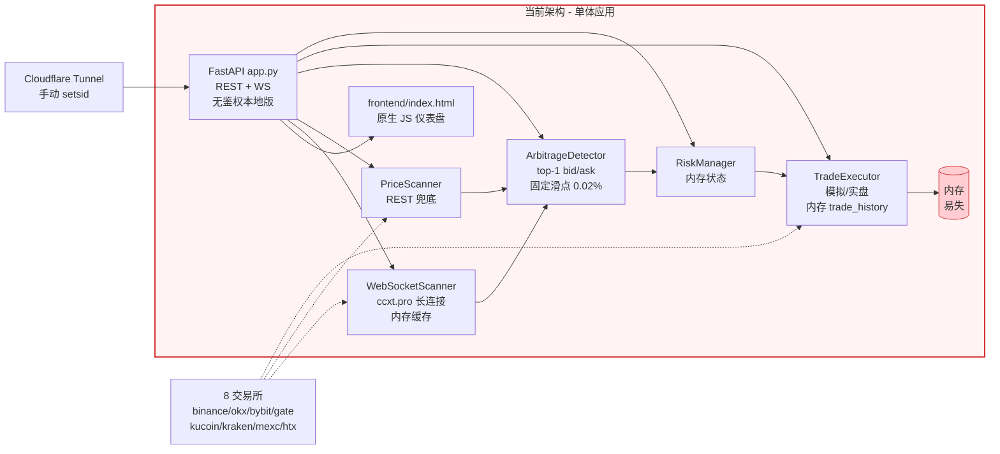
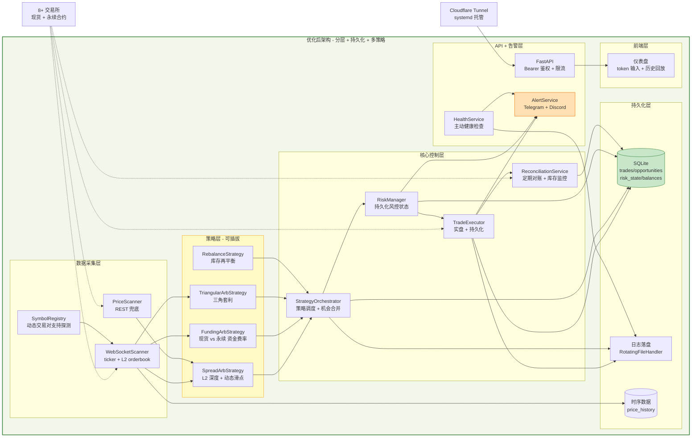
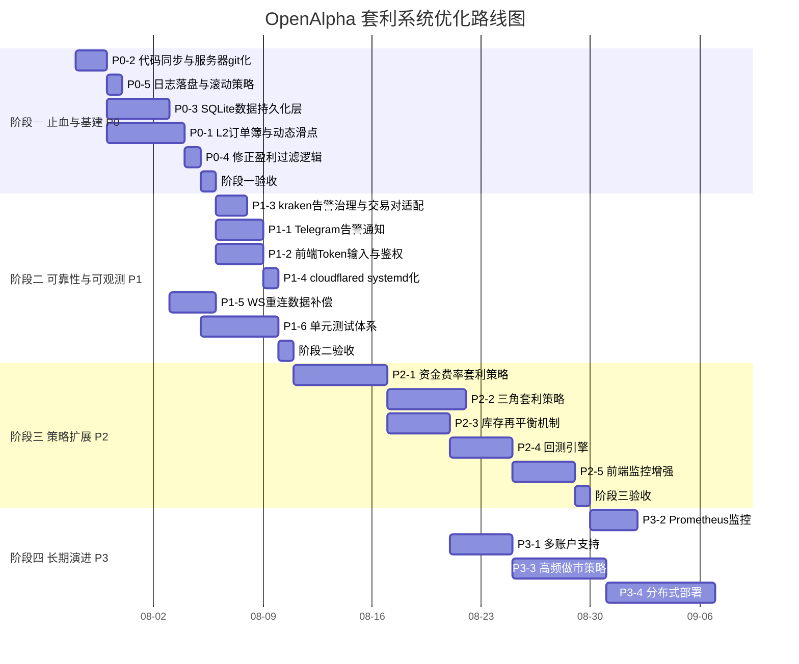
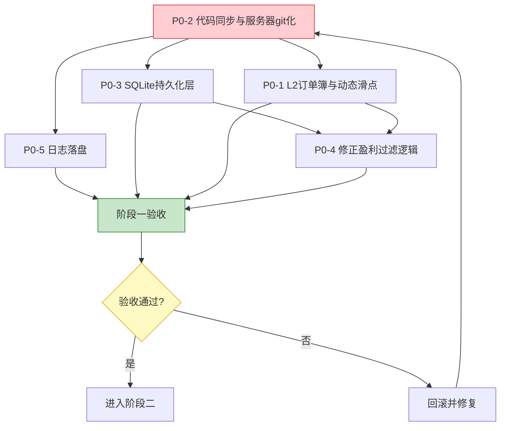
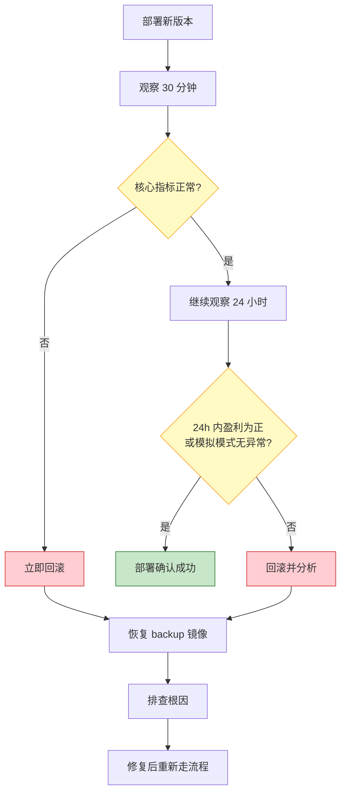
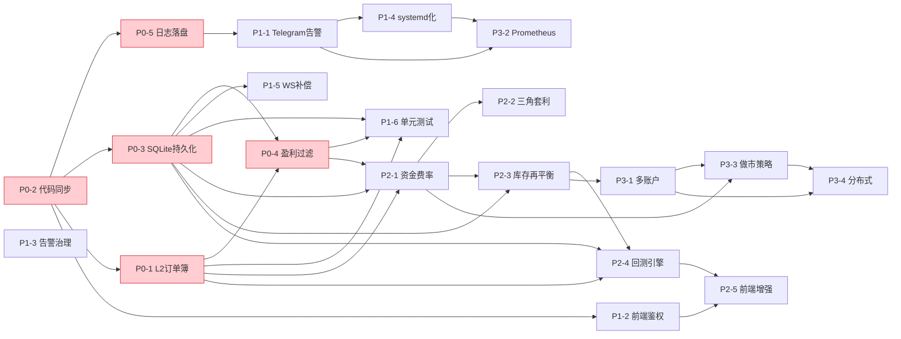

# OpenAlpha 套利交易系统 — 完整优化方案

> **文档版本**: v1.0
> **创建日期**: 2026-07-28
> **基线核实时间**: 2026-07-28 01:04 CST（SSH 实地核查）
> **目标读者**: 系统维护者 / 后续开发工程师
> **文档状态**: 待评审

---

## 目录

1. [执行摘要](#1-执行摘要)
2. [当前架构与优化后架构对比](#2-当前架构与优化后架构对比)
3. [优化任务清单（按优先级分级）](#3-优化任务清单按优先级分级)
4. [分阶段实施路线图](#4-分阶段实施路线图)
5. [风险评估与回滚方案](#5-风险评估与回滚方案)
6. [验收标准与成功指标](#6-验收标准与成功指标)

---

## 1. 执行摘要

### 1.1 当前状态评估

OpenAlpha 套利交易系统已具备完整的"扫描 → 检测 → 风控 → 执行 → 监控"闭环，部署在 Vultr 服务器（`45.76.212.254`）通过 Cloudflare Tunnel 暴露为 `arbitrage.openalpha.top`，容器已稳定运行 34 小时（RestartCount=0），扫描循环每 3 秒一次，能检测到 15-20 个套利机会。

但系统存在**一个致命问题**和**多个严重隐患**：

| 维度 | 当前状态 | 严重程度 |
|------|----------|----------|
| **盈利能力** | 所有套利机会净利润率为负；主流币跨主流所价差 0.01%-0.02%，双边手续费 0.2%，`min_profitability=-0.003` 允许微亏 | 🔴 致命 |
| **价格精度** | 仅用 ticker 的 top-1 bid/ask，未考虑 L2 订单簿深度；滑点固定 0.02% | 🔴 致命 |
| **策略多样性** | 仅纯现货跨所价差套利，无资金费率/三角/库存再平衡 | 🔴 致命 |
| **代码同步** | 服务器 `backend/auth.py` 未回流 git；`app.py` 服务器版多 5 行未提交；前端 +144/-95 行未提交；服务器目录非 git 仓库 | 🔴 严重 |
| **数据持久化** | 交易历史仅存内存（`executor.trade_history`），`data/` 目录为空，重启全丢 | 🟡 严重 |
| **日志告警** | 仅控制台输出，无落盘、无 Telegram/Discord 告警 | 🟡 严重 |
| **安全** | 前端无 token 输入入口（写操作无法执行）；`.env`/`.api_token` 明文；无限流 | 🟡 严重 |
| **可靠性** | kraken 不支持 ARB/USDT 持续刷日志；WS 重连无数据补偿 | 🟡 中等 |
| **可运维** | cloudflared 手动 `setsid` 启动，重启丢失；无 systemd 单元；无健康检查告警 | 🟢 中等 |
| **测试** | 无单元测试（TASK_PLAN 要求 ≥80% 覆盖率） | 🟢 中等 |
| **资源** | 磁盘 79%（18G/23G），内存 65%（615Mi/951Mi，紧张）；`openalpha` 容器崩溃循环占用资源 | 🟢 中等 |

### 1.2 优化目标

**核心目标**：将系统从"所有机会都亏钱"的演示状态，转变为"能稳定捕捉正期望套利机会"的生产级系统。

| 目标维度 | 量化指标 |
|----------|----------|
| 盈利能力 | 检测到的机会中 ≥30% 净利润率为正；实盘月度净盈利 > 0 |
| 价格精度 | 滑点估算误差 < 实际成交滑点的 20% |
| 数据完整性 | 交易历史/机会记录/日志重启后 100% 保留 |
| 可用性 | 容器重启后 60 秒内恢复扫描；cloudflared 随系统启动 |
| 可观测性 | 关键事件（成交/风控触发/错误）5 秒内推送 Telegram |
| 代码一致性 | 本地 git 与服务器运行版本 100% 一致 |
| 测试覆盖 | 核心模块（arbitrage/executor/risk_manager/config）覆盖率 ≥80% |

### 1.3 优化原则

1. **盈利优先**：盈利能力是核心，其他优化服务于盈利能力的可持续性。
2. **安全第一**：任何实盘相关改动必须先在模拟模式验证 ≥7 天。
3. **小步快跑**：每个任务可独立部署、独立回滚，避免大爆炸式发布。
4. **数据驱动**：所有策略改进必须基于历史数据回测，而非主观判断。
5. **不破坏现有**：优化过程中保持当前扫描/监控功能不中断。

---

## 2. 当前架构与优化后架构对比

### 2.1 当前架构



**当前架构关键缺陷**：
- 单体 `app.py`（803 行）承担路由 + 后台循环 + 状态管理，耦合严重
- 所有状态在内存，重启即失
- 价格仅 top-1，无 L2 深度
- 滑点固定 0.02%，与实际严重不符
- 无持久化层、无告警层、无回测层
- 服务器代码与 git 仓库脱节

### 2.2 优化后架构



### 2.3 架构演进关键变化

| 维度 | 当前 | 优化后 |
|------|------|--------|
| 价格数据 | top-1 bid/ask | L2 订单簿 + top-1 |
| 滑点 | 固定 0.02% | 基于订单量的动态计算 |
| 策略 | 单一价差套利 | 4 种可插拔策略 |
| 状态存储 | 内存 | SQLite 持久化 |
| 日志 | 控制台 | 落盘 + 滚动 |
| 告警 | 无 | Telegram + Discord |
| 鉴权 | 服务器有/本地无 | 统一 Bearer + 限流 |
| 部署 | 手动 cloudflared | systemd 托管 |
| 代码同步 | 服务器脱节 | git 单一源 |

---

## 3. 优化任务清单（按优先级分级）

### 优先级定义

| 优先级 | 含义 | 触发条件 |
|--------|------|----------|
| **P0** | 必须 | 阻塞盈利或存在数据丢失/安全风险 |
| **P1** | 重要 | 显著影响可靠性、可运维性、可观测性 |
| **P2** | 增强 | 提升系统能力、扩展策略 |
| **P3** | 远期 | 锦上添花、长期演进 |

### 3.1 P0 任务（必须 — 盈利与数据安全）

---

#### P0-1: L2 订单簿深度采集与动态滑点计算

**问题描述**
当前 [`arbitrage.py`](backend/arbitrage.py:38) 使用固定 `SLIPPAGE_FACTOR = 0.0002`（0.02%），且 [`scanner.py`](backend/scanner.py:290) 仅采集 ticker 的 top-1 bid/ask。主流币在主流所之间价差仅 0.01%-0.02%，而双边手续费 0.2%，导致所有机会净利润率为负。大单实际滑点远超 0.02% 估算，实盘会亏更多。

**解决方案**
1. 在 [`WebSocketScanner`](backend/scanner.py:406) 中增加 `watch_order_book` 订阅，缓存每个交易所每个交易对的 L2 订单簿（深度 N 档，建议 20 档）。
2. 新增 `OrderBookCache` 类，维护 `{exchange: {symbol: {bids: [...], asks: [...], ts}}}` 结构。
3. 在 [`ArbitrageDetector._detect_symbol_opportunity`](backend/arbitrage.py:104) 中，用订单簿模拟实际成交：按 `order_amount` 从 ask 侧逐档累加买入、从 bid 侧逐档累加卖出，计算加权平均成交价。
4. 动态滑点 = (加权成交价 - top-1 价格) / top-1 价格，替代固定 `SLIPPAGE_FACTOR`。
5. 净利润率公式改为：`(加权卖出收入 - 加权买入成本) / 加权买入成本 - 双边手续费`。
6. 当订单簿深度不足覆盖 `order_amount` 时，标记为 `RiskLevel.HIGH` 并跳过。

**涉及文件**
- [`backend/scanner.py`](backend/scanner.py:1) — 增加 L2 订阅与缓存
- [`backend/arbitrage.py`](backend/arbitrage.py:1) — 改用订单簿计算
- [`backend/models.py`](backend/models.py:37) — 新增 `OrderBookSnapshot` 模型
- [`backend/config.py`](backend/config.py:52) — 新增 `order_book_depth` 配置项

**预估工作量**: L

**依赖关系**: 无（基础设施任务，其他盈利任务依赖此）

---

#### P0-2: 代码同步与服务器 git 化

**问题描述**
服务器 `backend/auth.py`（113 行鉴权模块）未同步回本地 git 仓库，一旦服务器故障将永久丢失。服务器 `app.py` 比本地多 5 行（鉴权集成）未提交。本地 `frontend/index.html` 有 +144/-95 行未提交修改。服务器目录非 git 仓库，无法 `git pull` 更新，导致后续所有优化无法部署。

**解决方案**
1. **回流 auth.py**：从服务器 `scp` 下载 `backend/auth.py` 到本地 git 仓库。
2. **回流 app.py 差异**：`diff` 服务器与本地 `app.py`，将鉴权集成代码合并回本地（用条件加载，本地无 token 时跳过鉴权）。
3. **提交前端修改**：审查本地 `frontend/index.html` 的 +144/-95 行修改，提交到 git。
4. **服务器 git 化**：在服务器 `/root/openalpha-arbitrage` 执行 `git init` + `git remote add origin` + `git fetch` + `git checkout main`（保留 `.env`/`config.yaml`/`data` 不覆盖）。
5. **统一鉴权策略**：将 `auth.py` 改为可通过环境变量 `REQUIRE_AUTH=true/false` 控制，本地开发关闭、生产开启。
6. **建立部署 SOP**：文档化"本地提交 → push → 服务器 pull → docker compose up -d --build"流程。

**涉及文件**
- [`backend/auth.py`](backend/auth.py:1) — 新建（从服务器回流）
- [`backend/app.py`](backend/app.py:1) — 合并鉴权集成
- [`frontend/index.html`](frontend/index.html:1) — 提交未保存修改
- 新增 `docs/DEPLOY_SOP.md` — 部署标准流程

**预估工作量**: M

**依赖关系**: 无（所有部署类任务依赖此）

---

#### P0-3: SQLite 数据持久化层

**问题描述**
[`executor.trade_history`](backend/executor.py:61) 仅存内存列表，[`app.py`](backend/app.py:71) 的 `latest_opportunities` 同样易失。`data/` 目录为空，容器重启后所有交易历史和机会记录丢失，无法回测分析、无法审计、无法统计长期盈亏。

**解决方案**
1. 新增 `backend/database.py`，使用 `aiosqlite`（异步 SQLite）封装数据访问层。
2. 数据库文件路径 `/app/data/arbitrage.db`（已通过 docker volume 挂载）。
3. 建表：
   - `trades`：交易记录（id/symbol/buy_exchange/sell_exchange/prices/amount/status/profit/paper_trade/timestamp/created_at）
   - `opportunities`：检测到的机会快照（id/symbol/exchanges/prices/spread/net_profit_rate/risk_level/timestamp）
   - `risk_state`：风控状态快照（date/open_positions/daily_pnl/daily_trade_count/exchange_exposure/halted）
   - `balances`：余额快照（exchange/asset/free/used/total/timestamp）
   - `price_history`：时序价格数据（exchange/symbol/bid/ask/last/volume/timestamp）— 可选，按需启用
4. 改造 [`TradeExecutor`](backend/executor.py:37)：每次交易结果写入 `trades` 表；`get_trade_history` 改为从 DB 查询。
5. 改造 [`ArbitrageDetector`](backend/arbitrage.py:41)：检测到的机会批量写入 `opportunities` 表（可采样，如每分钟存一次避免膨胀）。
6. 改造 [`RiskManager`](backend/risk_manager.py:35)：每日状态写入 `risk_state`，重启时从 DB 恢复当日风控状态。
7. 新增 `/api/trades/history` 端点支持分页查询、时间范围筛选。
8. 数据保留策略：`trades`/`opportunities` 保留 90 天，`price_history` 保留 7 天，定时清理。

**涉及文件**
- 新增 `backend/database.py` — 数据访问层
- [`backend/executor.py`](backend/executor.py:1) — 集成 DB 写入
- [`backend/arbitrage.py`](backend/arbitrage.py:1) — 集成 DB 写入
- [`backend/risk_manager.py`](backend/risk_manager.py:1) — 状态持久化与恢复
- [`backend/app.py`](backend/app.py:1) — 新增历史查询端点
- [`backend/requirements.txt`](backend/requirements.txt:1) — 新增 `aiosqlite`
- [`backend/models.py`](backend/models.py:1) — 新增查询响应模型

**预估工作量**: L

**依赖关系**: P0-2（需要 git 化才能部署）

---

#### P0-4: 修正 min_profitability 与盈利过滤逻辑

**问题描述**
生产 `config.yaml` 中 `min_profitability=-0.003` 允许微亏，配合固定滑点估算，实盘会持续亏钱。当前 [`arbitrage.py:170`](backend/arbitrage.py:170) 的过滤逻辑 `if net_profit_rate < min_profit` 在负阈值下几乎不过滤任何机会，导致执行器频繁执行亏损交易。

**解决方案**
1. 将 `min_profitability` 默认值改为正数（建议 `0.001`，即 0.1% 净利润），生产 `config.yaml` 同步修正。
2. 在 [`ArbitrageDetector`](backend/arbitrage.py:41) 中增加"最小绝对利润"过滤（如 `estimated_profit >= 0.5 USDT`），避免小额正利润被手续费吞噬。
3. 增加"价差合理性"校验：价差 > 5% 视为数据异常（交易所 API 延迟/故障），标记 `RiskLevel.HIGH` 并跳过，避免误执行。
4. 配合 P0-1 的动态滑点，确保净利润率计算基于真实可成交价格。
5. 在 [`RiskManager.check`](backend/risk_manager.py:78) 中增加盈利性二次校验：`opportunity.net_profit_rate <= 0` 时直接拒绝。

**涉及文件**
- [`backend/arbitrage.py`](backend/arbitrage.py:1) — 过滤逻辑
- [`backend/risk_manager.py`](backend/risk_manager.py:1) — 盈利性校验
- [`config.yaml`](config.yaml:1) — 修正阈值
- [`backend/config.py`](backend/config.py:52) — 调整默认值

**预估工作量**: S

**依赖关系**: P0-1（动态滑点是准确过滤的前提）

---

#### P0-5: 日志落盘与滚动策略

**问题描述**
[`app.py:46`](backend/app.py:46) 的 `logging.basicConfig` 仅输出到控制台，容器重启后日志全丢。无法事后排查问题、无法审计交易决策、无法统计错误率。

**解决方案**
1. 新增 `backend/logging_config.py`，配置 `RotatingFileHandler`：
   - 主日志 `/app/data/logs/arbitrage.log`，单文件 10MB，保留 10 个
   - 错误日志 `/app/data/logs/error.log`，仅 WARNING+，单文件 5MB，保留 5 个
   - 交易日志 `/app/data/logs/trades.log`，独立 logger `openalpha.trades`
2. 同时保留控制台输出（`StreamHandler`），便于 `docker logs` 查看。
3. 日志格式增加 `container_id`/`pid` 便于多实例区分。
4. 在 [`docker-compose.yml`](docker-compose.yml:1) 中确认 `./data:/app/data` 挂载（已存在）。
5. 关键事件结构化日志：交易成交、风控触发、WS 断连、余额不足等用 JSON 格式，便于后续解析。

**涉及文件**
- 新增 `backend/logging_config.py`
- [`backend/app.py`](backend/app.py:46) — 替换 `logging.basicConfig`
- [`backend/executor.py`](backend/executor.py:1) — 交易 logger
- [`backend/risk_manager.py`](backend/risk_manager.py:1) — 风控 logger

**预估工作量**: S

**依赖关系**: P0-3（日志目录与 DB 同在 `data/`）

---

### 3.2 P1 任务（重要 — 可靠性与可观测性）

---

#### P1-1: Telegram/Discord 告警通知

**问题描述**
系统无任何主动告警机制。交易成交、风控触发、WS 断连、余额不足等关键事件只能通过前端仪表盘被动查看，维护者无法及时响应。

**解决方案**
1. 新增 `backend/notifier.py`，实现 `AlertService` 类，支持 Telegram Bot API 和 Discord Webhook。
2. 告警级别：
   - **CRITICAL**：风控 halt、实盘交易亏损超过单笔阈值、交易所 API 密钥失效
   - **WARNING**：WS 连续断连、余额低于阈值、单日亏损接近上限
   - **INFO**：实盘交易成交（含盈亏）、每日盈亏汇总、系统启动/停止
3. 告警去重：相同事件 5 分钟内只通知一次（避免刷屏）。
4. 配置通过环境变量：`TELEGRAM_BOT_TOKEN`、`TELEGRAM_CHAT_ID`、`DISCORD_WEBHOOK_URL`。
5. 在 [`TradeExecutor`](backend/executor.py:37)、[`RiskManager`](backend/risk_manager.py:35)、[`WebSocketScanner`](backend/scanner.py:406) 关键路径注入 `AlertService`。
6. 新增 `/api/alert/test` 端点用于测试告警通道。

**涉及文件**
- 新增 `backend/notifier.py`
- [`backend/executor.py`](backend/executor.py:1) — 注入告警
- [`backend/risk_manager.py`](backend/risk_manager.py:1) — 注入告警
- [`backend/scanner.py`](backend/scanner.py:1) — WS 断连告警
- [`backend/app.py`](backend/app.py:1) — 测试端点 + 生命周期集成
- [`backend/config.py`](backend/config.py:1) — 告警配置加载

**预估工作量**: M

**依赖关系**: P0-5（日志体系先行）

---

#### P1-2: 前端 Token 输入与鉴权完善

**问题描述**
服务器前端 `grep token=0`，无 token 输入入口，导致所有写操作（启动套利、修改配置、执行交易）无法从前端执行。本地版 [`app.py`](backend/app.py:1) 无鉴权，存在安全风险。

**解决方案**
1. 在 [`frontend/index.html`](frontend/index.html:1) 顶部增加 token 输入框 + 保存到 `localStorage`。
2. 所有 fetch 请求增加 `Authorization: Bearer <token>` 头（从 `localStorage` 读取）。
3. WebSocket 连接 URL 增加 `?token=<token>` 参数，服务端校验。
4. 统一 [`auth.py`](backend/auth.py:1)（P0-2 回流后）为可选中间件：`REQUIRE_AUTH=true` 时校验，`false` 时放行（本地开发）。
5. token 失效时前端弹出提示并清空 `localStorage`，引导重新输入。
6. 增加请求限流中间件（`slowapi` 或自实现令牌桶），限制每 IP 每分钟 60 次请求。

**涉及文件**
- [`frontend/index.html`](frontend/index.html:1) — token 输入 UI + 请求拦截
- [`backend/auth.py`](backend/auth.py:1) — 统一鉴权 + 限流
- [`backend/app.py`](backend/app.py:1) — 注册中间件
- [`backend/requirements.txt`](backend/requirements.txt:1) — 新增 `slowapi`

**预估工作量**: M

**依赖关系**: P0-2（auth.py 回流）

---

#### P1-3: kraken ARB/USDT 告警治理与交易对动态适配

**问题描述**
kraken 不支持 ARB/USDT，[`scanner.py:546`](backend/scanner.py:546) 的 `_get_valid_symbols` 已能过滤，但每次启动都打印告警刷日志。更深层问题：交易对列表硬编码在 [`config.py:40`](backend/config.py:40)，无法适应各交易所支持差异。

**解决方案**
1. 在 [`WebSocketScanner._get_valid_symbols`](backend/scanner.py:535) 中，将"不支持交易对"信息从 `logger.info` 降级为 `logger.debug`，仅在首次记录 INFO。
2. 新增 `SymbolRegistry` 类，启动时对各交易所 `load_markets`，缓存每个交易所支持的交易对集合。
3. [`config.py`](backend/config.py:1) 增加 `validate_symbols()` 方法，返回每个交易对各交易所的支持情况。
4. 新增 `/api/symbols/support` 端点，前端可视化展示交易对支持矩阵。
5. 长期：支持"按交易所自定义交易对子集"，避免在不支持的交易所上浪费请求。

**涉及文件**
- [`backend/scanner.py`](backend/scanner.py:1) — 告警降级
- 新增 `backend/symbol_registry.py`
- [`backend/config.py`](backend/config.py:1) — 交易对校验
- [`backend/app.py`](backend/app.py:1) — 新端点

**预估工作量**: S

**依赖关系**: 无

---

#### P1-4: cloudflared systemd 化与健康检查

**问题描述**
cloudflared 通过手动 `setsid` 启动，服务器重启后丢失，导致 `arbitrage.openalpha.top` 不可访问。无主动健康检查，故障只能靠人工发现。

**解决方案**
1. 创建 `/etc/systemd/system/cloudflared.service`：
   ```
   [Unit]
   Description=Cloudflare Tunnel
   After=network-online.target
   [Service]
   ExecStart=/usr/local/bin/cloudflared tunnel run openalpha
   Restart=always
   RestartSec=5
   [Install]
   WantedBy=multi-user.target
   ```
2. `systemctl enable --now cloudflared`，替换手动 `setsid` 进程。
3. 在 [`app.py`](backend/app.py:1) 新增 `/api/health` 端点，返回各组件健康状态（DB/WS/交易所连接/内存）。
4. 配置 Cloudflare Tunnel 健康检查指向 `/api/health`。
5. 健康检查异常时通过 P1-1 的告警通道通知。
6. 清理崩溃循环的 `openalpha` 容器（与套利无关但占用资源），释放内存。

**涉及文件**
- 新增 `deploy/cloudflared.service`（文档化，实际部署到服务器）
- [`backend/app.py`](backend/app.py:1) — `/api/health` 端点
- 新增 `docs/DEPLOY_SOP.md` — systemd 部署步骤

**预估工作量**: S

**依赖关系**: P1-1（健康检查告警依赖告警服务）

---

#### P1-5: WS 重连数据补偿机制

**问题描述**
[`WebSocketScanner._ws_watch_loop`](backend/scanner.py:553) 重连后直接继续 `watch_tickers`，无数据补偿。重连期间的价格变化丢失，可能导致基于过期数据的套利决策。

**解决方案**
1. 在 [`_ws_watch_loop`](backend/scanner.py:553) 重连成功后，立即调用一次 `fetch_tickers` 全量刷新缓存，再继续 WS 订阅。
2. 记录每次 WS 断连的起止时间，写入日志和 DB（`ws_disconnects` 表）。
3. 在 [`ArbitrageDetector`](backend/arbitrage.py:41) 中增加"数据新鲜度"校验：若某交易所缓存数据时间戳超过 `scan_interval * 3` 秒，标记该交易所数据为 stale，跳过其套利检测。
4. 在 [`app.py`](backend/app.py:1) 的 `latest_prices` 中增加 `data_freshness` 字段，前端展示数据新鲜度。

**涉及文件**
- [`backend/scanner.py`](backend/scanner.py:1) — 重连补偿
- [`backend/arbitrage.py`](backend/arbitrage.py:1) — 新鲜度校验
- [`backend/app.py`](backend/app.py:1) — 新鲜度暴露
- [`frontend/index.html`](frontend/index.html:1) — 新鲜度展示

**预估工作量**: M

**依赖关系**: P0-3（断连记录持久化）

---

#### P1-6: 单元测试体系建立

**问题描述**
无任何单元测试，[`docs/tasks/TASK_PLAN.md`](docs/tasks/TASK_PLAN.md:30) 要求 ≥80% 覆盖率。每次改动都靠手动验证，回归风险高。

**解决方案**
1. 配置 `pytest` + `pytest-asyncio` + `pytest-cov` + `pytest-mock`。
2. 测试目录结构：
   - `tests/test_config.py` — 配置加载/更新/环境变量覆盖
   - `tests/test_arbitrage.py` — 套利检测逻辑（含 L2 深度计算）
   - `tests/test_risk_manager.py` — 风控规则触发/恢复
   - `tests/test_executor.py` — 执行器（mock CCXT）
   - `tests/test_scanner.py` — 扫描器（mock ccxt.pro）
   - `tests/test_database.py` — 数据访问层
   - `tests/test_app.py` — API 端点集成测试（FastAPI TestClient）
3. CI 集成：GitHub Actions 在 PR 时自动运行测试 + 覆盖率检查。
4. 覆盖率门槛：核心模块 ≥80%，整体 ≥70%。

**涉及文件**
- 新增 `tests/` 目录及所有测试文件
- 新增 `pytest.ini` / `pyproject.toml` 配置
- 新增 `.github/workflows/test.yml`
- [`backend/requirements.txt`](backend/requirements.txt:1) — 新增测试依赖（dev）

**预估工作量**: L

**依赖关系**: P0-1、P0-3、P0-4（被测代码需先稳定）

---

### 3.3 P2 任务（增强 — 策略扩展与能力提升）

---

#### P2-1: 资金费率套利策略

**问题描述**
当前仅纯现货跨所价差套利，利润空间极小。永续合约的资金费率机制提供了新的套利维度：当资金费率为正时，做多现货 + 做空永续可赚取费率；反之亦然。

**解决方案**
1. 新增 `backend/strategies/funding_arb.py`，实现 `FundingArbStrategy`。
2. 在 [`scanner.py`](backend/scanner.py:1) 中增加永续合约行情订阅（`watch_tickers` with `defaultType: swap`）。
3. 定期获取各交易所资金费率（`fetch_funding_rate`），缓存费率历史。
4. 套利逻辑：
   - 检测资金费率 > 阈值（如 0.05%）的合约
   - 在现货所买入基础资产，在合约所开空单
   - 等待资金费率结算（通常 8 小时一次），收取费率
   - 平仓时反向操作
5. 风险控制：合约保证金占用、强平价格、基差波动。
6. 与 [`RiskManager`](backend/risk_manager.py:35) 集成，增加合约敞口限制。

**涉及文件**
- 新增 `backend/strategies/funding_arb.py`
- 新增 `backend/strategies/base.py` — 策略基类
- [`backend/scanner.py`](backend/scanner.py:1) — 永续行情订阅
- [`backend/risk_manager.py`](backend/risk_manager.py:1) — 合约风控
- [`backend/app.py`](backend/app.py:1) — 策略注册与调度

**预估工作量**: L

**依赖关系**: P0-1、P0-3、P0-4（基础设施就绪）

---

#### P2-2: 三角套利策略

**问题描述**
单一交易对跨所价差套利空间有限。三角套利利用同一交易所内三个交易对的汇率不一致（如 BTC/USDT → ETH/BTC → ETH/USDT），可在单所内完成，无需跨所转账。

**解决方案**
1. 新增 `backend/strategies/triangular_arb.py`，实现 `TriangularArbStrategy`。
2. 识别三角路径：选择基础货币（USDT）、中间货币（BTC/ETH），枚举所有 `A→B→C→A` 路径。
3. 对每个交易所，用其 L2 订单簿计算三角套利净利润率（扣三边手续费 + 滑点）。
4. 执行：在同一交易所连续下三笔限价/市价单，任一失败则回滚已成交部分。
5. 风险：执行时序风险（三笔单非原子）、价格漂移。

**涉及文件**
- 新增 `backend/strategies/triangular_arb.py`
- [`backend/executor.py`](backend/executor.py:1) — 三角执行逻辑
- [`backend/arbitrage.py`](backend/arbitrage.py:1) — 三角检测复用

**预估工作量**: L

**依赖关系**: P0-1（L2 订单簿）、P2-1（策略框架）

---

#### P2-3: 库存再平衡机制

**问题描述**
跨所套利会导致资金在交易所间失衡：低价所持续买入消耗 USDT，高价所持续卖出积累基础资产。长期运行后某所资金耗尽，套利停止。当前无再平衡机制。

**解决方案**
1. 新增 `backend/rebalancer.py`，实现 `RebalanceService`。
2. 定期（如每小时）查询各交易所余额，计算理想配比与实际偏差。
3. 当偏差超过阈值（如某所 USDT 余额 < 总量 20%）时，触发再平衡：
   - 优先通过反向套利自然再平衡（在资金多的所卖出、少的所买入）
   - 必要时通过链上转账（考虑手续费 + 到账时间）
4. 再平衡成本计入套利利润计算，避免"看似盈利实则被转账费吞噬"。
5. 与 [`RiskManager`](backend/risk_manager.py:35) 集成，再平衡期间暂停新套利。

**涉及文件**
- 新增 `backend/rebalancer.py`
- [`backend/executor.py`](backend/executor.py:1) — 余额查询复用
- [`backend/risk_manager.py`](backend/risk_manager.py:1) — 再平衡状态
- [`backend/app.py`](backend/app.py:1) — 再平衡调度

**预估工作量**: L

**依赖关系**: P0-3（余额持久化）、P2-1（策略框架）

---

#### P2-4: 回测引擎

**问题描述**
无法验证策略改进效果。每次改动都需实盘观察，成本高、周期长。`opportunities` 表（P0-3）积累了历史机会数据，但无回测工具。

**解决方案**
1. 新增 `backend/backtest.py`，实现 `BacktestEngine`。
2. 从 `opportunities` 和 `price_history` 表加载历史数据。
3. 模拟执行：对历史机会按当时价格 + 滑点模型计算理论利润。
4. 支持参数扫描：批量测试不同 `min_profitability`/`order_amount` 组合的收益。
5. 输出回测报告：总交易数、胜率、总盈亏、最大回撤、夏普比率。
6. 新增 `/api/backtest/run` 端点 + 前端回测面板。

**涉及文件**
- 新增 `backend/backtest.py`
- [`backend/app.py`](backend/app.py:1) — 回测端点
- [`frontend/index.html`](frontend/index.html:1) — 回测面板

**预估工作量**: L

**依赖关系**: P0-3（历史数据）、P0-1（滑点模型）

---

#### P2-5: 前端监控增强

**问题描述**
[`frontend/index.html`](frontend/index.html:1) 功能基础，缺少历史回放、策略切换、回测可视化等生产级监控能力。

**解决方案**
1. 交易历史表格：分页、筛选（时间/交易所/盈亏）、导出 CSV。
2. 套利机会热力图：交易对 × 交易所矩阵展示价差。
3. 策略管理面板：启用/禁用各策略、调整参数。
4. 回测结果可视化：收益曲线、交易分布图。
5. 数据新鲜度指示器：各交易所数据延迟实时展示。
6. 响应式布局适配移动端。

**涉及文件**
- [`frontend/index.html`](frontend/index.html:1) — 全面增强

**预估工作量**: L

**依赖关系**: P0-2、P0-3、P1-2、P2-4

---

### 3.4 P3 任务（远期 — 长期演进）

---

#### P3-1: 多账户与子账户支持

**问题描述**
单账户套利受限于单所敞口限制（500 USDT）。多账户可分散敞口、提升容量。

**解决方案**
支持每个交易所配置多个 API Key，执行器轮询使用，风控按账户独立计算。

**涉及文件**: [`backend/config.py`](backend/config.py:1)、[`backend/executor.py`](backend/executor.py:1)、[`backend/risk_manager.py`](backend/risk_manager.py:1)

**预估工作量**: L

**依赖关系**: P2-3

---

#### P3-2: Prometheus + Grafana 监控

**问题描述**
当前监控依赖前端仪表盘，无长期指标存储和告警规则。

**解决方案**
1. 新增 `backend/metrics.py`，暴露 `/metrics` 端点（Prometheus 格式）。
2. 指标：扫描延迟、机会数、交易数、盈亏、WS 连接状态、内存占用。
3. 部署 Prometheus + Grafana 容器，配置仪表盘和告警规则。

**涉及文件**: 新增 `backend/metrics.py`、`deploy/prometheus.yml`、`deploy/grafana/`

**预估工作量**: M

**依赖关系**: P1-1、P1-4

---

#### P3-3: 高频做市策略

**问题描述**
套利机会稀疏，资金利用率低。做市策略可提供持续收益。

**解决方案**
在流动性较低的交易对上挂双边限价单赚取价差，与套利策略共享库存。

**涉及文件**: 新增 `backend/strategies/market_making.py`

**预估工作量**: L

**依赖关系**: P2-1、P2-3

---

#### P3-4: 多服务器分布式部署

**问题描述**
单服务器受限于网络延迟和 IP 限制（部分交易所对单 IP 限流）。

**解决方案**
多地域部署扫描节点，中心节点聚合决策，分布式执行。

**涉及文件**: 架构级改造

**预估工作量**: L

**依赖关系**: P3-1、P3-2

---

## 4. 分阶段实施路线图

### 4.1 阶段划分



### 4.2 阶段目标

| 阶段 | 目标 | 完成标志 |
|------|------|----------|
| **阶段一** | 止血 + 基建 | 代码同步、数据不丢、日志可查、盈利过滤正确、L2 滑点准确 |
| **阶段二** | 可靠 + 可观测 | 告警可达、鉴权完整、WS 稳定、测试覆盖、systemd 托管 |
| **阶段三** | 策略 + 能力 | 多策略盈利、库存平衡、可回测、前端完善 |
| **阶段四** | 演进 + 扩展 | 多账户、监控体系、做市、分布式 |

### 4.3 阶段一详细执行顺序

阶段一是止血阶段，必须严格按序执行：



---

## 5. 风险评估与回滚方案

### 5.1 阶段一风险评估

| 任务 | 风险 | 概率 | 影响 | 缓解措施 | 回滚方案 |
|------|------|------|------|----------|----------|
| **P0-2 代码同步** | 合并 app.py 鉴权代码时引入 bug，导致服务无法启动 | 中 | 高 | 本地 Docker 验证通过后再部署；保留服务器原文件备份 | `git checkout` 回退到同步前 commit；服务器恢复原文件 |
| **P0-2 服务器 git 化** | `git checkout` 覆盖服务器 `.env`/`config.yaml` | 低 | 致命 | `.gitignore` 排除敏感文件；`git stash` 保护本地修改 | 从备份恢复 `.env`/`config.yaml` |
| **P0-3 SQLite 持久化** | DB schema 变更导致旧数据不兼容 | 中 | 中 | 使用 Alembic 迁移或版本号检查；首次部署空库 | 删除 `arbitrage.db` 重建（无历史数据可丢） |
| **P0-3 SQLite 持久化** | aiosqlite 异步写入阻塞事件循环 | 低 | 中 | 批量写入 + 写队列；WAL 模式 | 回退到内存模式（`paper_trade=true`） |
| **P0-1 L2 订单簿** | L2 订阅增加内存占用，触发 OOM（当前内存已 65%） | 中 | 高 | 限制缓存深度（20 档）；限制订阅交易对数；监控内存 | 关闭 L2 订阅，回退 top-1 模式 |
| **P0-1 L2 订单簿** | 部分交易所不支持 `watch_order_book` | 中 | 低 | 降级为 `fetch_order_book` 轮询；不支持则用 top-1 | 该交易所回退 top-1 |
| **P0-4 盈利过滤** | 阈值过严导致无机会可执行 | 高 | 低 | 先观察 7 天机会分布再调参；保留 `paper_trade=true` | 降低 `min_profitability` 阈值 |
| **P0-5 日志落盘** | 磁盘空间不足（当前 79%）导致日志写入失败 | 中 | 中 | 严格滚动策略；定时清理；监控磁盘 | 关闭文件日志，仅控制台 |

### 5.2 阶段二风险评估

| 任务 | 风险 | 概率 | 影响 | 缓解措施 | 回滚方案 |
|------|------|------|------|----------|----------|
| **P1-1 告警** | Telegram Bot token 泄露 | 低 | 中 | token 仅存环境变量；不写入日志 | 撤销并重新生成 token |
| **P1-1 告警** | 告警刷屏 | 中 | 低 | 去重 + 分级 + 静默期 | 关闭告警服务 |
| **P1-2 鉴权** | 前端 token 存 localStorage 被 XSS 窃取 | 中 | 高 | CSP 策略；输入消毒；短期 token | 清空所有 token，强制重新登录 |
| **P1-2 限流** | 限流误伤正常请求 | 低 | 低 | 合理阈值；白名单本地 IP | 调高限流阈值 |
| **P1-4 systemd** | cloudflared 配置错误导致隧道断开 | 中 | 高 | 保留旧 `setsid` 进程直到 systemd 验证通过 | 启动旧 `setsid` 进程 |
| **P1-5 WS 补偿** | 重连后全量刷新增加 API 调用，触发限流 | 中 | 中 | 限流退避；分批刷新 | 关闭补偿，接受短暂数据过期 |
| **P1-6 测试** | 测试 mock 不准确，掩盖真实 bug | 中 | 中 | 集成测试用真实 CCXT 沙箱；代码审查 | 补充集成测试 |

### 5.3 阶段三风险评估

| 任务 | 风险 | 概率 | 影响 | 缓解措施 | 回滚方案 |
|------|------|------|------|----------|----------|
| **P2-1 资金费率** | 合约强平导致大额亏损 | 中 | 致命 | 严格保证金率监控；自动减仓；小仓位试水 | 禁用资金费率策略，仅现货 |
| **P2-1 资金费率** | 基差波动导致对冲失效 | 中 | 高 | 基差监控；异常时立即平仓 | 同上 |
| **P2-2 三角套利** | 三笔单非原子，中间价格漂移 | 高 | 中 | 限价单 + 超时取消；滑点容忍度 | 禁用三角策略 |
| **P2-3 库存再平衡** | 链上转账延迟导致资金卡住 | 中 | 中 | 仅在余额严重失衡时转账；预留缓冲资金 | 暂停再平衡，手动处理 |
| **P2-4 回测** | 历史数据不全导致回测失真 | 中 | 中 | 先积累 ≥30 天数据再回测 | 标注回测结果置信度低 |

### 5.4 通用回滚原则

1. **每个任务独立可回滚**：通过 feature flag 或配置开关控制，无需代码回退。
2. **数据库变更向前兼容**：新增字段而非修改/删除，旧代码忽略新字段。
3. **部署前快照**：每次部署前 `docker tag` 当前镜像为 `:backup`，回滚即 `docker compose up -d` 指定 backup 镜像。
4. **实盘保护**：所有策略改动先在 `paper_trade=true` 模式运行 ≥7 天，验证后再切实盘。
5. **资金安全底线**：单日亏损超过 `max_daily_loss` 的 50% 时，自动切换 `paper_trade=true` 并告警。

### 5.5 回滚决策流程



---

## 6. 验收标准与成功指标

### 6.1 阶段一验收标准

| 验收项 | 标准 | 验证方法 |
|--------|------|----------|
| 代码同步 | 本地 git 与服务器运行版本 `diff` 为空 | `diff` 命令 |
| 数据持久化 | 容器重启后 `trades`/`opportunities` 表数据不丢 | 重启后查询 DB |
| 日志落盘 | `/app/data/logs/arbitrage.log` 存在且有内容 | `docker exec` 检查 |
| L2 订单簿 | 至少 4 个交易所成功订阅 L2 | `/api/exchanges` 查看 mode |
| 动态滑点 | 滑点估算随 `order_amount` 变化 | 不同 amount 对比 |
| 盈利过滤 | `min_profitability >= 0`；负利润机会不执行 | 观察 `/api/opportunities` |
| 内存稳定 | 容器内存 < 800Mi（当前 615Mi） | `docker stats` |

### 6.2 阶段二验收标准

| 验收项 | 标准 | 验证方法 |
|--------|------|----------|
| 告警可达 | 测试告警 5 秒内收到 Telegram | `/api/alert/test` |
| 鉴权生效 | 无 token 请求写操作返回 401 | curl 验证 |
| 限流生效 | 超过 60 次/分钟返回 429 | 压测 |
| systemd | 服务器重启后 cloudflared 自动启动 | `systemctl status` |
| WS 补偿 | 重连后 10 秒内数据刷新 | 模拟断连测试 |
| 测试覆盖 | 核心模块 ≥80% | `pytest --cov` |
| 健康检查 | `/api/health` 返回各组件状态 | curl |

### 6.3 阶段三验收标准

| 验收项 | 标准 | 验证方法 |
|--------|------|----------|
| 资金费率套利 | 模拟模式 7 天净盈利 > 0 | 回测 + 模拟实盘 |
| 三角套利 | 模拟模式胜率 > 60% | 回测 |
| 库存再平衡 | 各所余额偏差 < 30% | 余额监控 |
| 回测引擎 | 支持参数扫描 + 报告导出 | 功能测试 |
| 前端增强 | 历史表格/热力图/回测面板可用 | 手动验证 |

### 6.4 长期成功指标

| 指标 | 目标 | 衡量周期 |
|------|------|----------|
| 月度净盈利 | > 0 USDT（实盘） | 月 |
| 策略胜率 | > 55% | 月 |
| 系统可用性 | > 99.5% | 月 |
| 平均扫描延迟 | < 500ms | 实时 |
| 告警响应时间 | < 10 秒 | 实时 |
| 数据完整性 | 0 条丢失 | 月 |

---

## 附录 A: 任务依赖关系总览



## 附录 B: 关键配置变更对照

| 配置项 | 当前值 | 优化后建议值 | 说明 |
|--------|--------|--------------|------|
| `min_profitability` | -0.003（生产） | 0.001 | 从允许微亏改为要求正利润 |
| `order_amount` | 0.01 | 按交易对动态 | 不同币种下单量差异大 |
| `scan_interval` | 3 | 3 | 保持不变 |
| `max_order_age` | 180 | 60 | 缩短超时，降低敞口时间 |
| `paper_trade` | true | true（阶段一二） | 实盘需手动切 |
| `fee_rate` | 0.001 | 按交易所实际 | 各所费率不同 |
| 新增 `order_book_depth` | - | 20 | L2 订阅档数 |
| 新增 `require_auth` | - | true（生产） | 鉴权开关 |
| 新增 `telegram_bot_token` | - | 环境变量 | 告警 |
| 新增 `db_path` | - | /app/data/arbitrage.db | 数据库路径 |

---

> **文档结束**
> 本方案基于 2026-07-28 的系统状态设计，实施过程中如发现新问题，应更新本文档并重新评审。
